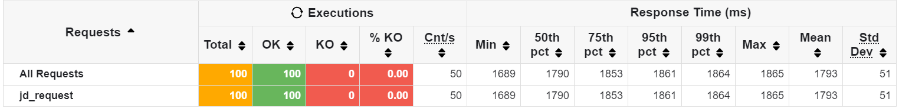
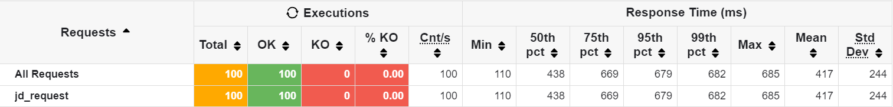
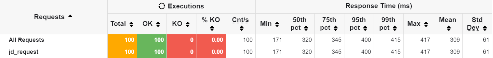

# 系统介绍

由product、cart、counter、discovery、gateway组成，api为公用的接口组件等。

运行先在webpos-api文件夹下，

```
mvn install
```

然后先在discovery以及其他目录下

```
mvn spring-boot:run
```

以启动完整的微服务系统。

# 水平扩展实验

仅对product做了实验。

## 启动一个product微服务



## 启动两个product微服务



## 启动三个product微服务



可以看到启动的服务越多，响应越快。

# RestTemplate&&断路器

只在cart服务调用counter服务功能的部分运用这两个机制。